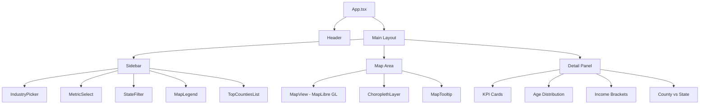
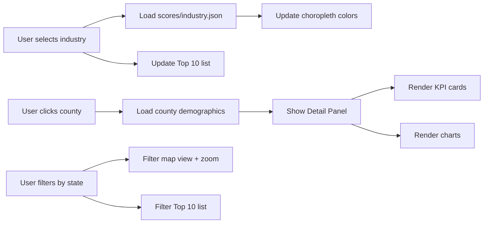
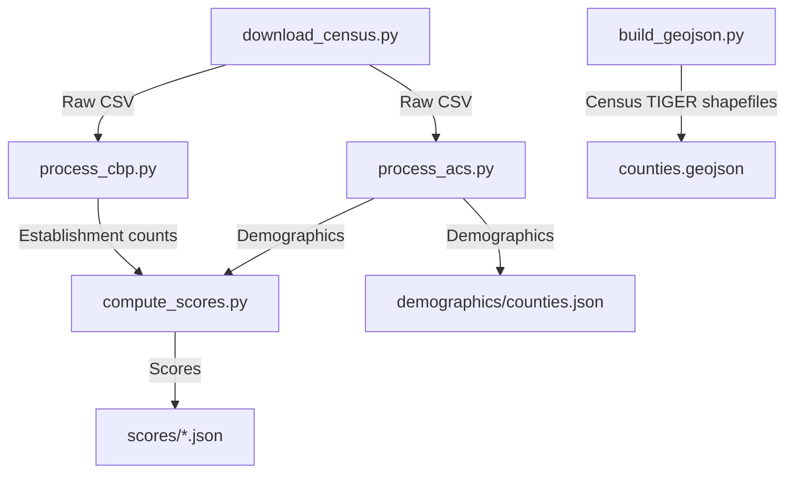

# MapGap.online — Architecture Document

## Overview

**MapGap** is a single-page web application that visualizes underserved business markets across US counties. Users select a business category and instantly see a county-level choropleth map colored by an "opportunity score" — a composite metric reflecting high demand but low business density. Clicking a county reveals a detail panel with demographics, business counts, and comparison charts.

**URL:** mapgap.online
**Type:** Static frontend — no backend server, no authentication, no API
**Target Users:** Entrepreneurs, small business investors, market researchers, franchise developers

---

## Tech Stack

| Layer | Choice | Rationale |
|-------|--------|-----------|
| Framework | React 18 + TypeScript + Vite | Fast builds, strong typing, modern tooling |
| UI Components | shadcn/ui + Tailwind CSS 3.4 | Enterprise aesthetic, fully customizable, accessible. Using v3 (not v4) because shadcn/ui tooling expects `tailwind.config.ts` (JS-based config). |
| Map | MapLibre GL JS | Fully open-source, no API key, near-identical API to Mapbox GL |
| Charts | Recharts | Mature React + D3 wrapper, flexible bar/area charts |
| Data | Pre-processed static JSON + GeoJSON | No backend needed, served from `/public/data/` |
| Fonts | Inter (via Google Fonts or self-hosted) | Clean, tight hierarchy, pairs well with shadcn |
| Linting | ESLint 9 (flat config) with `@eslint/js` + `typescript-eslint` | Zero-warning policy (`--max-warnings 0`), catches bugs early. See ESLint Configuration below. |
| TopoJSON (fallback) | topojson-client npm package | Only needed if GeoJSON exceeds 5MB after simplification. Not installed by default — see Performance Considerations. |
| Deployment | DigitalOcean (Server 2) + Caddy | Static files served from `/var/www/mapgap/dist`, deployed via rsync |

### Port Configuration

| Port | Component | Type |
|------|-----------|------|
| 3034 | dev-server | Vite dev server |

---

## Project Structure

```
product-mapgap/
├── docs/
│   └── architecture.md
├── scripts/                    # Data preprocessing (Python)
│   ├── requirements.txt
│   ├── download_census.py      # Download raw Census data
│   ├── process_cbp.py          # Process County Business Patterns
│   ├── process_acs.py          # Process American Community Survey
│   ├── compute_scores.py       # Calculate opportunity scores
│   └── build_geojson.py        # Simplify & merge county boundaries
├── public/
│   ├── favicon.svg             # Site favicon (map pin or grid icon)
│   └── data/
│       ├── counties.geojson    # Simplified county boundaries (~5MB target)
│       ├── industries.json     # Industry category list with NAICS codes
│       ├── scores/             # One JSON per industry
│       │   ├── coffee-shops.json
│       │   ├── pet-grooming.json
│       │   ├── gyms.json
│       │   └── ...
│       └── demographics/       # County-level demographic data
│           └── counties.json   # All counties demographic lookup
├── src/
│   ├── main.tsx
│   ├── App.tsx
│   ├── index.css               # Tailwind directives + custom styles
│   ├── lib/
│   │   └── utils.ts            # shadcn utility (cn function)
│   ├── types/
│   │   ├── index.ts
│   │   ├── industry.ts         # Industry & NAICS types
│   │   ├── county.ts           # County data types
│   │   └── score.ts            # Opportunity score types
│   ├── hooks/
│   │   ├── useIndustryData.ts  # Load & cache industry score data
│   │   ├── useCountyData.ts    # Load county demographics
│   │   └── useMapState.ts      # Map viewport, selected county, hover
│   ├── components/
│   │   ├── ui/                 # shadcn/ui primitives (auto-generated)
│   │   ├── layout/
│   │   │   ├── Header.tsx
│   │   │   ├── Sidebar.tsx
│   │   │   └── MobileSheet.tsx # Sidebar as bottom sheet on mobile
│   │   ├── controls/
│   │   │   ├── IndustryPicker.tsx   # Searchable combobox (shadcn Command)
│   │   │   ├── MetricSelect.tsx     # Score vs individual metrics
│   │   │   └── StateFilter.tsx      # Optional state filter
│   │   ├── map/
│   │   │   ├── MapView.tsx          # MapLibre GL container
│   │   │   ├── ChoroplethLayer.tsx  # County fill layer logic
│   │   │   ├── MapTooltip.tsx       # Hover tooltip
│   │   │   └── MapLegend.tsx        # Gradient legend
│   │   ├── detail/
│   │   │   ├── DetailPanel.tsx      # County detail container
│   │   │   ├── KPICards.tsx         # Score, biz count, pop, income
│   │   │   ├── AgeChart.tsx         # Age distribution bar chart
│   │   │   ├── IncomeChart.tsx      # Income bracket bar chart
│   │   │   └── ComparisonChart.tsx  # County vs state average
│   │   ├── sidebar/
│   │   │   └── TopCountiesList.tsx  # Top 10 counties table
│   │   └── about/
│   │       └── AboutDialog.tsx      # Methodology modal (shadcn Dialog)
│   └── data/
│       ├── colorScales.ts      # Color gradient definitions
│       └── stateList.ts        # US states for filter dropdown
├── tailwind.config.ts
├── vite.config.ts
├── tsconfig.json
├── package.json
├── eslint.config.js            # ESLint flat config (zero-warning policy)
├── .gitignore
└── README.md
```

---

## Component Architecture



### State Flow



---

## Data Models

### Industry Definition (`industries.json`)

```typescript
interface Industry {
  id: string;              // e.g., "coffee-shops"
  label: string;           // e.g., "Coffee Shops"
  naicsCodes: string[];    // e.g., ["722515"]
  description: string;     // Brief description
}
```

### County Score Data (`scores/{industry-id}.json`)

```typescript
interface CountyScore {
  fips: string;                // 5-digit FIPS code
  name: string;                // County name
  state: string;               // State abbreviation
  score: number;               // 0-100 opportunity score
  establishmentCount: number;  // Number of businesses
  populationPerBiz: number;    // Population / establishment count
}

// File format: Record<string, CountyScore> keyed by FIPS
type IndustryScores = Record<string, CountyScore>;
```

### County Demographics (`demographics/counties.json`)

```typescript
interface CountyDemographics {
  fips: string;
  name: string;
  state: string;
  population: number;
  medianIncome: number;
  medianAge: number;
  householdSize: number;
  populationGrowth: number;     // 5-year % change
  ageDistribution: {
    under18: number;
    age18to34: number;
    age35to54: number;
    age55to74: number;
    age75plus: number;
  };
  incomeDistribution: {
    under25k: number;
    income25kTo50k: number;
    income50kTo75k: number;
    income75kTo100k: number;
    over100k: number;
  };
  stateAverages: {              // For comparison charts
    medianIncome: number;
    medianAge: number;
    populationPerSqMi: number;
  };
}

// File format: Record<string, CountyDemographics> keyed by FIPS
type AllCountyDemographics = Record<string, CountyDemographics>;
```

### GeoJSON Structure (`counties.geojson`)

Standard GeoJSON FeatureCollection. Each feature has:
- `geometry`: MultiPolygon (simplified to ~5MB total file)
- `properties.GEOID`: 5-digit FIPS code (used as join key)
- `properties.NAME`: County name
- `properties.STATE`: State FIPS code

---

## Opportunity Score Formula

```
score = normalize(
    (population / establishment_count) ×
    median_income_weight ×
    population_growth_weight
)
```

### Weight Definitions

| Factor | Weight | Rationale |
|--------|--------|-----------|
| Population per business | Base metric | Higher = more underserved |
| Median income | 1.0 + 0.3 × normalize(income) | Wealthier areas = more purchasing power |
| Population growth | 1.0 + 0.2 × normalize(growth) | Growing areas = future demand |

### Normalization

All scores are min-max normalized to 0-100 within each industry category. Counties with zero establishments get a capped maximum raw score (to avoid infinity) before normalization.

---

## Data Pipeline (Python Scripts)

The `scripts/` directory contains Python scripts that download and preprocess Census data into the static JSON files served by the frontend.

### Pipeline Steps



### Script Details

1. **`download_census.py`** — Downloads County Business Patterns and ACS 5-Year data from Census Bureau bulk files. Stores raw CSVs in `scripts/raw/` (gitignored).

2. **`process_cbp.py`** — Parses CBP data, maps NAICS codes to industry categories, outputs establishment counts per county per industry.

3. **`process_acs.py`** — Extracts population, income, age, household data per county. Computes state averages for comparison.

4. **`compute_scores.py`** — Joins CBP + ACS data, applies the opportunity score formula, outputs one JSON file per industry into `public/data/scores/`.

5. **`build_geojson.py`** — Downloads Census TIGER/Line county shapefiles, simplifies geometry (using `topojson` or `shapely`), outputs `public/data/counties.geojson`.

### Dependencies (`scripts/requirements.txt`)

```
pandas>=2.0
geopandas>=0.14
shapely>=2.0
requests>=2.31
topojson>=1.7
```

### Running the Pipeline

```bash
cd scripts
pip install -r requirements.txt
python download_census.py
python process_cbp.py
python process_acs.py
python compute_scores.py
python build_geojson.py
```

---

## UI Design Specifications

### Layout

- **Header**: Fixed top bar. Logo/site name left. "About" and "GitHub" links right.
- **Sidebar**: Fixed left, 280px wide. Contains: IndustryPicker, MetricSelect, StateFilter, MapLegend (gradient), TopCountiesList.
- **Map**: Fills remaining width. Light basemap (no clutter). Counties colored light gray → light indigo → deep indigo sequential gradient by score. Hover tooltip. Click selects.
- **Detail Panel**: Below map. Slides open on county click. KPI cards across top, bar charts below.

### Color System

The choropleth uses a sequential light-to-dark palette so that higher scores appear visually stronger, which is the conventional expectation for "higher = more opportunity":

| Element | Color |
|---------|-------|
| Low score (0) | Light gray (`#e5e7eb`) |
| Mid score (50) | Light indigo (`#a5b4fc`) |
| High score (100) | Deep indigo (`#3730a3`) |
| Accent / interactive | Indigo-600 (`#4f46e5`) |
| Background | White / Slate-50 |
| Dark mode background | Slate-950 |

### Responsive Behavior

| Breakpoint | Layout |
|------------|--------|
| Desktop (≥1024px) | Sidebar left, map right, detail below map |
| Tablet (768-1023px) | Sidebar collapses to top bar with dropdowns |
| Mobile (<768px) | Full-screen map. Controls in top sheet (shadcn Sheet). Detail panel as bottom drawer (shadcn Drawer) |

### Dark Mode

Implemented via shadcn/ui's built-in theme system. Toggle in header. Uses Tailwind's `dark:` variants. Map basemap switches between light and dark styles.

---

## Key Implementation Details

### Map Initialization

```typescript
// MapView.tsx — key setup
const map = new maplibregl.Map({
  container: mapRef.current,
  style: 'https://basemaps.cartocdn.com/gl/positron-gl-style/style.json', // light
  center: [-98.5, 39.8], // Center of US
  zoom: 4,
  minZoom: 3,
  maxZoom: 12,
});
```

Dark mode basemap: `https://basemaps.cartocdn.com/gl/dark-matter-gl-style/style.json`

### Choropleth Rendering

The county GeoJSON is loaded once as a map source. When the user selects an industry, the fill color expression is updated using a MapLibre `match` expression built from the score data:

```typescript
map.setPaintProperty('county-fill', 'fill-color', [
  'interpolate',
  ['linear'],
  ['match', ['get', 'GEOID'], ...fipsScorePairs, 0],
  0, '#e5e7eb',
  50, '#a5b4fc',
  100, '#3730a3'
]);
```

### Data Loading Strategy

- **GeoJSON** (`counties.geojson`): Loaded lazily when the map component mounts (not on app mount). ~2-3MB after simplification. Cached by browser. A loading spinner overlay is shown on the map until the GeoJSON is fully loaded.
- **Industry list** (`industries.json`): Loaded once on mount. Small file.
- **Score files** (`scores/{id}.json`): Loaded on-demand when user selects an industry. ~50-100KB each. Cached in a React ref/Map to avoid re-fetching. Industry IDs are validated against the loaded `industries.json` list before constructing the fetch URL (see Security Considerations).
- **Demographics** (`demographics/counties.json`): Loaded lazily on first county click. ~2-3MB.

### Performance Considerations

- **GeoJSON optimization**: The `counties.geojson` file is the largest single payload (~2-5MB). To minimize load time:
  - Simplify geometry using `topojson` with a quantization of 1e5 and a simplification tolerance of 0.01 (tunable — reduce tolerance if file exceeds 3MB)
  - Target file size: **2-3MB** after simplification. Hard ceiling: **5MB**.
  - The `build_geojson.py` script must log the final file size and warn if it exceeds 3MB
  - Browser caching handles repeat visits (GeoJSON is immutable between deploys)
  - **Fallback**: If simplification cannot get below 5MB, convert to TopoJSON format on disk and decode client-side using the `topojson-client` npm package (~3KB gzipped). This typically achieves 60-80% size reduction vs GeoJSON. The architecture does not use TopoJSON by default to keep the client simpler, but this is the documented escape hatch.
- Use `React.memo` on chart components to avoid re-renders when hovering the map
- Debounce map hover events (16ms / requestAnimationFrame)
- Use `useMemo` for Top 10 county sorting

### Error & Empty States

| Scenario | UI Behavior |
|----------|-------------|
| GeoJSON loading | Map area shows centered spinner with "Loading map..." text |
| GeoJSON load failure | Map area shows error message with retry button |
| Score file loading | Sidebar shows skeleton loader; map counties remain gray |
| Score file load failure | Toast notification with error; map remains in previous state |
| Demographics loading | Detail panel shows skeleton placeholders for KPI cards and charts |
| Demographics load failure | Detail panel shows inline error with retry button |
| County has no score data | County renders as gray on map; tooltip shows "No data available" |
| No counties match state filter | Top 10 list shows "No results" message; map shows empty filtered view |
| Industry list load failure | Full-page error state with retry button (app cannot function without industry list) |

---

## Industry Categories

Initial set of ~15-20 curated categories covering common small businesses:

| Category | NAICS Codes | Description |
|----------|-------------|-------------|
| Coffee Shops | 722515 | Coffee & snack bars |
| Pet Grooming | 812910 | Pet care services |
| Gyms & Fitness | 713940 | Fitness centers |
| Laundromats | 812310 | Coin-operated laundries |
| Daycare Centers | 624410 | Child day care services |
| Auto Repair | 811111 | General auto repair |
| Bakeries | 311811 | Retail bakeries |
| Barbershops | 812111 | Barber shops |
| Dentists | 621210 | Offices of dentists |
| Veterinarians | 541940 | Veterinary services |
| Pharmacies | 446110 | Pharmacies & drug stores |
| Florists | 453110 | Florist shops |
| Insurance Agents | 524210 | Insurance agencies |
| Real Estate | 531210 | Real estate agents |
| Restaurants | 722511 | Full-service restaurants |

---

## Build & Verification

### Build Command

```bash
npm run build
```

Expected: Zero errors, `dist/` directory created with all static assets.

### Lint Command

```bash
npm run lint
```

Expected: Zero errors, zero warnings.

### Type Check

```bash
npx tsc --noEmit
```

Expected: Zero type errors.

### Dev Server

```bash
npm run dev
# Runs on port 3034
```

---

## ESLint Configuration

ESLint 9 flat config using `@eslint/js` and `typescript-eslint`. The config file is `eslint.config.js` (not `.eslintrc`).

```javascript
// eslint.config.js
import js from '@eslint/js';
import tseslint from 'typescript-eslint';

export default tseslint.config(
  js.configs.recommended,
  ...tseslint.configs.recommended,
  {
    ignores: ['dist/', 'node_modules/', 'public/'],
  },
  {
    files: ['src/**/*.{ts,tsx}'],
    rules: {
      // Adjust as needed, but start with recommended defaults.
      // No rules should be set to "warn" — use "error" or "off" only
      // to enforce the zero-warning policy.
    },
  },
);
```

### Lint Script

```json
{
  "scripts": {
    "lint": "eslint src/ --max-warnings 0"
  }
}
```

The `--max-warnings 0` flag enforces the zero-warning policy: any warning is treated as a build failure. ESLint must be configured during project scaffolding (before any application code is written) so that all subsequent development benefits from linting.

---

## Testing Strategy

- **Framework:** Vitest
- **Run:** `npm run test`

### What to Test

| Area | Test Type | Description |
|------|-----------|-------------|
| Opportunity score normalization | Unit | Verify score calculation produces correct 0-100 range |
| Color scale interpolation | Unit | Verify FIPS → color mapping |
| Data loading hooks | Unit | Verify JSON parsing, caching, error states |
| Industry filtering | Unit | Verify state filter narrows results |
| Top 10 sorting | Unit | Verify correct ordering by score |
| Component rendering | Unit | Verify key components render without crash (smoke tests) |

### Test Configuration

```typescript
// vitest.config.ts
import { defineConfig } from 'vitest/config';

export default defineConfig({
  test: {
    environment: 'jsdom',
    globals: true,
    setupFiles: ['./src/test/setup.ts'],
  },
});
```

---

## Documentation Requirements

### README.md Must Include

1. Project description and live URL
2. Screenshot / GIF of the map in action
3. Tech stack summary
4. Development setup instructions (`npm install`, `npm run dev`)
5. Data pipeline instructions (how to re-process Census data)
6. Build and deployment instructions
7. Industry category list
8. Opportunity score methodology summary

### About/Methodology Page (In-App)

A shadcn Dialog accessible from the header "About" link. Covers:
- What the opportunity score means
- Data sources and vintage (year)
- Formula explanation
- Limitations and caveats
- Link to GitHub repo

---

## Asset Manifest

### Static Data Files (Generated by Pipeline)

| File | Size Estimate | Description |
|------|--------------|-------------|
| `public/data/counties.geojson` | 2-3 MB (hard ceiling 5 MB) | Simplified county boundaries (see Performance Considerations for optimization strategy) |
| `public/data/industries.json` | ~2 KB | Industry category definitions |
| `public/data/scores/*.json` | ~50-100 KB each | Per-industry county scores |
| `public/data/demographics/counties.json` | 2-3 MB | All county demographics |

### Static Assets (Non-Data)

| Asset | Location | Notes |
|-------|----------|-------|
| Favicon | `public/favicon.svg` | SVG favicon (map pin or grid icon), referenced in `index.html` |

### External Assets

| Asset | Source | Notes |
|-------|--------|-------|
| Map tiles | CARTO basemaps (CDN) | Free, no API key. Positron (light) + Dark Matter (dark) |
| Font: Inter | Google Fonts or self-hosted | Variable weight, ~100KB |
| No images/icons required | — | shadcn uses Lucide icons (bundled) |

---

## Deployment

### Vercel Configuration

```json
// vercel.json (if needed)
{
  "buildCommand": "npm run build",
  "outputDirectory": "dist",
  "framework": "vite"
}
```

### Environment

No environment variables needed. Fully static site. No secrets, no API keys.

### Domain

- Production: `mapgap.online`
- Configure in Vercel dashboard after first deploy

---

## Security Considerations

This is a fully static site with no backend, no authentication, no user data collection, and no API keys. Security surface is minimal:

- **No CSRF needed** — No state-changing requests
- **No authentication** — Public data only
- **No API keys in frontend** — Map tiles are from free CARTO CDN (no key)
- **CSP headers** — Configure via Vercel to restrict script sources
- **Subresource Integrity** — For any CDN-loaded scripts/styles
- **Input validation for data fetching** — Industry IDs used to construct score file paths (`scores/{id}.json`) must be validated against the known industry list from `industries.json` before fetching. This prevents path traversal in development and ensures only valid data files are requested. The `useIndustryData` hook must reject any ID not present in the loaded industry list.

---

## Design Decisions

### ComparisonChart: Population Density Excluded

**Decision:** The `ComparisonChart` component compares only Median Income and Median Age between the selected county and its state average. Population density (`populationPerSqMi`) is intentionally excluded despite being present in the `StateAverages` data model.

**Rationale:**
- **No county-level counterpart.** The `CountyDemographics` type does not include a `populationPerSqMi` field at the county level — only `stateAverages` carries it. Without a county-side value, a meaningful county-vs-state bar comparison cannot be rendered.
- **Scale mismatch.** Population density values (people per square mile) differ by orders of magnitude from income (thousands of dollars) and age (years). Placing all three on a single shared Y-axis would compress the income and age bars to near-invisible slivers, or require a dual-axis chart that adds complexity without proportional insight.
- **Marginal analytical value.** For the target audience (entrepreneurs evaluating market opportunity), median income and median age are the most actionable demographic comparators. Density is less directly tied to business viability than purchasing power and age profile, and is already indirectly captured by the opportunity score formula's population-per-business base metric.

**`populationPerSqMi` is retained** in the `StateAverages` type and demographic data files for potential future use (e.g., a dedicated density map layer or a standalone KPI card) without requiring a data pipeline change.

---

## Future Enhancements (Out of Scope)

These are noted for potential future iterations, not for initial implementation:

- User accounts / saved searches
- Custom industry NAICS code entry
- County comparison mode (side-by-side)
- Export to PDF/CSV
- Swap to Mapbox GL if premium features needed
- Real-time data from Census API
- Canadian market support
